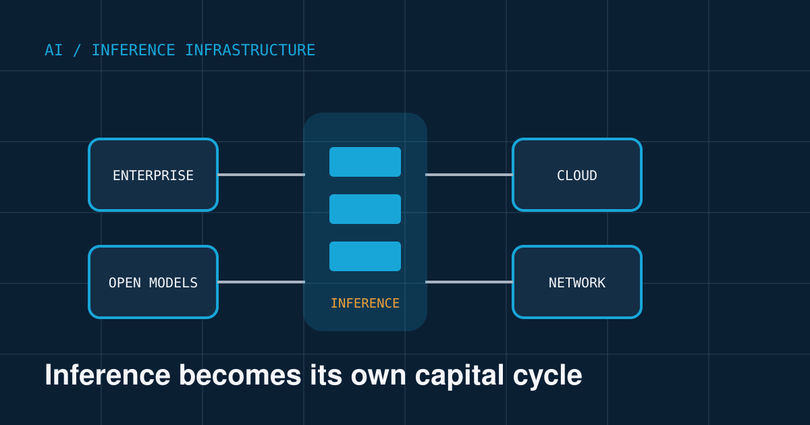
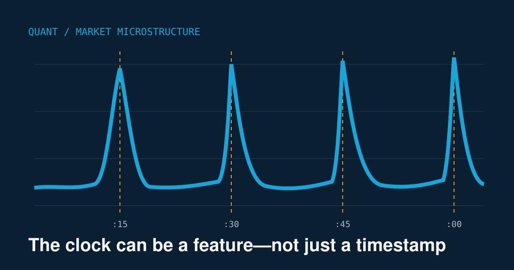
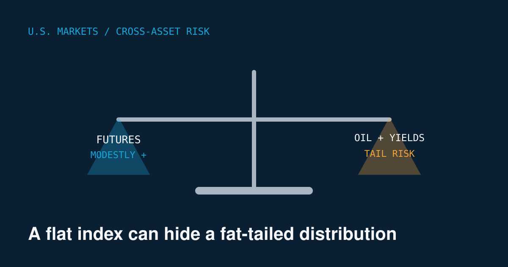
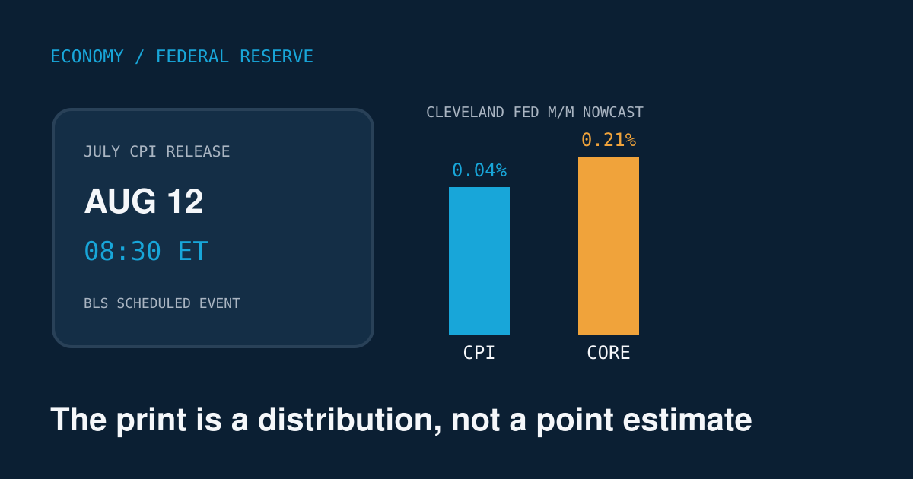
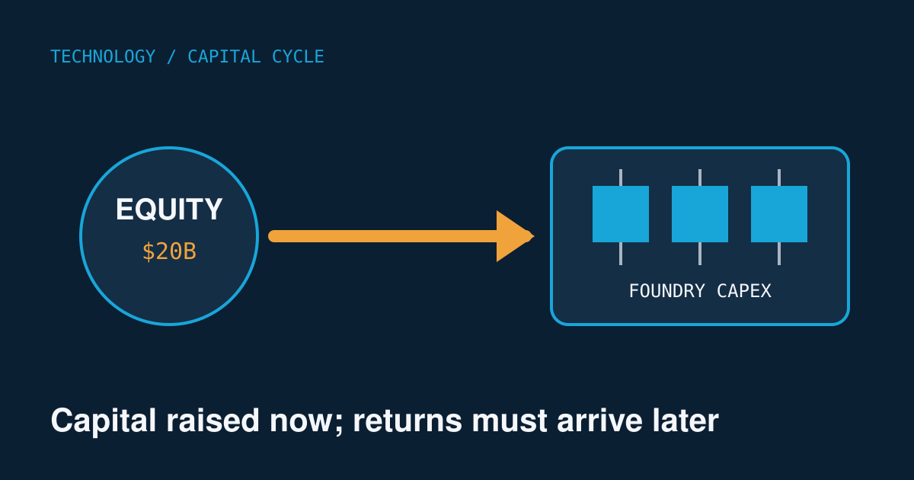

# Quant Market Brief — August 12, 2026

**Research cutoff: Wednesday, August 12, 2026 — 6:29 a.m. CT**  
Market data are indicative, delayed, or prior-close as labeled. The July CPI release was scheduled for 7:30 a.m. CT, after this edition's cutoff.

## 1. AI / Machine Learning

### IBM and Together AI plan a large U.S. Blackwell inference cluster

**Facts:** IBM and Together AI signed a multi-year agreement valued at $240 million to build an inference cluster on IBM Cloud. The initial deployment is expected to contain approximately 2,000 NVIDIA Blackwell 300 chips, HGX B300 systems, and Spectrum-X networking. It will serve open-source models including DeepSeek, MiniMax, and Kimi. Together AI expects capacity to be committed before service begins, although that is a company projection. [Reuters — August 11](https://www.reuters.com/business/ibm-together-ai-ink-240-million-deal-nvidia-powered-ai-inference-cluster-2026-08-11/)

**Why it matters:** Compute spending is shifting from model training toward persistent inference workloads. Technical teams should focus on tokens per watt, tail latency, model-routing efficiency, and utilization—not headline GPU count. For markets, the announcement supports demand across IBM, NVDA, networking, power, and cooling, but it does not establish customer profitability or cluster utilization.

**Uncertainty:** Capacity commitments and future utilization are company expectations, not independently verified operating results.

## 2. Algorithmic Trading / Quantitative Finance

### Citadel Securities sees conditions forming for systematic re-leveraging

**Facts:** Citadel Securities strategist Scott Rubner argues that the July technical reset has largely run its course and that declining volatility could permit volatility-targeting and other systematic strategies to rebuild leverage. MarketWatch cited the VIX near 15 and potentially supportive retail, passive, and corporate flows. This is an attributed strategist assessment—not disclosed real-time positioning from systematic funds. [MarketWatch — August 12](https://www.marketwatch.com/story/citadel-securities-called-the-stock-market-reset-now-it-says-leverage-may-build-up-again-988eec86)

**Why it matters:** Re-leveraging can create persistent, price-insensitive buying when realized volatility falls, but the same feedback loop reverses quickly after a volatility shock. Quant systems should distinguish slow volatility-control flows from event-driven positioning around CPI.

**Uncertainty:** The assessment is a market interpretation; reliable, real-time aggregate exposure for volatility-control funds was not available.

## 3. U.S. Markets / SPY–QQQ / Options

### Nasdaq futures outperform before CPI as AI infrastructure shares rally

**Facts:** At 6:00 a.m. CT, Dow, S&P 500, and Nasdaq-100 E-minis were up 0.11%, 0.25%, and 0.65%, respectively. CoreWeave was indicated 18.2% higher premarket, Super Micro 9.2% higher, and IREN, Applied Digital, and Nebius more than 5% higher. These were premarket indications, not opening prices. [Reuters — August 12](https://www.reuters.com/business/wall-st-futures-tick-up-heading-into-july-inflation-data-2026-08-12/)

Tuesday's prior close was softer: the S&P 500 fell 0.3%, Nasdaq 0.6%, while the Russell 2000 gained 0.3%. [AP market close](https://apnews.com/article/wall-street-stocks-dow-nasdaq-e5e8f3360f8d30714778761e3a483347)

**Why it matters:** NQ's overnight leadership was concentrated in AI infrastructure and vulnerable to the inflation release. For SPY/QQQ execution, the key confirmation is whether post-CPI breadth includes IWM, equal-weight equities, and credit rather than only a small AI cluster.

**Uncertainty:** Futures and premarket indications can change materially before the cash open; verified exchange-depth and dealer-gamma feeds were unavailable.

## 4. U.S. Economy / Federal Reserve

### July CPI arrives at 7:30 a.m. CT with September policy expectations nearly split

**Facts:** BLS was scheduled to release July CPI and real earnings at 7:30 a.m. CT. The official release had not occurred at this edition's cutoff. [BLS calendar](https://www.bls.gov/schedule/2026/08_sched_list.htm)

A Reuters economist survey forecast headline CPI of +0.1% month over month and +3.4% year over year, versus June's -0.4% and +3.5%. Money markets were approximately evenly divided between a September quarter-point increase and no change. At 5:59 a.m. CT, the 10-year Treasury yield was approximately 4.668%, down 1.6 basis points, while DXY was near 99.831. [Reuters CPI preview](https://www.reuters.com/business/us-consumer-prices-likely-increased-moderately-july-gasoline-prices-eased-2026-08-12/)

**Why it matters:** The composition matters more than the headline. Persistent services and shelter inflation would be more hawkish than an energy-driven surprise. A hot core reading would pressure duration-sensitive QQQ and long Treasuries; a softer report could trigger volatility compression.

**Uncertainty:** Forecasts and market-implied policy probabilities were pre-release estimates and could change immediately after CPI.

## 5. Major Technology / Business

### Intel raises $20 billion through an upsized equity offering

**Facts:** Intel priced an upsized share offering at $95 per share, a 2.6% discount to the preceding close, raising approximately $20 billion after initially targeting $15 billion. Proceeds support foundry facilities and advanced packaging. Intel previously increased expected 2026 capital expenditure from $18 billion to $20 billion. [Reuters — updated August 11](https://www.reuters.com/legal/transactional/intel-launches-15-billion-share-sale-turnaround-rally-lifts-stock-2026-08-10/)

**Why it matters:** The offering monetizes Intel's share-price recovery but creates dilution and raises the execution bar for its foundry strategy. Watch whether capital converts into external customer wins, utilization, and free cash flow—not merely additional capacity.

**Uncertainty:** Capital deployment, customer wins, and future utilization remain execution-dependent.

# Quant & Market Dashboard

## Overnight liquidity

- **Futures:** ES +0.25%, NQ +0.65%, and Dow E-mini +0.11% at 6:00 a.m. CT—indicative; no verified exchange-depth or overnight-volume feed was available.
- **ETFs:** SPY and QQQ cash markets were closed. Reliable pre-open spreads, depth, and creation/redemption activity were unavailable.
- **Rates/funding proxy:** Ten-year Treasury near 4.668% and DXY near 99.831 at 5:59 a.m. CT. No verified live repo, SOFR, or Treasury order-book data were accessible.
- **Conclusion:** Headline liquidity appeared orderly, but executable depth should have been assumed fragile through CPI.

## Volatility regime

**Moderate, medium confidence.** VIX was reported near 15, consistent with contained implied volatility, while positive futures and easing yields indicated no broad funding stress. The classification was raised from low because CPI, energy uncertainty, and concentrated AI positioning created jump risk. Live VIX term structure, skew, and dealer gamma were not verified.

## Factor performance

Latest accessible comparison snapshots were captured in late July and were not live; returns are approximate total-return proxies.

| Factor proxy | One month | Six months | Signal |
|---|---:|---:|---|
| Momentum — MTUM | -7.2% | +17.9% | Sharp short-term unwind; medium-term lead remained |
| Value — VTV | +1.5% | +13.0% | Persistent medium-term strength |
| Quality — QUAL | +1.7% | +7.1% | Positive, behind value |
| Size — IWM | -2.2% | +11.3% | Recent pause after strong medium-term rotation |
| Growth — VUG | +0.7% | +2.3% | Weak medium-term relative performance |
| Low volatility — USMV | +1.6% | +2.9% | Recent defense, limited medium-term upside |

Sources: [MTUM/USMV](https://portfolioslab.com/tools/stock-comparison/USMV/MTUM), [QUAL/VTV](https://portfolioslab.com/tools/stock-comparison/QUAL/VTV), and [IWM/VUG](https://portfolioslab.com/tools/stock-comparison/IWM/VUG). Use directionally; differing snapshot times prevent precise cross-sectional ranking.

## SPY/QQQ and options execution risk

- CPI arrived one hour before the opening auction. Overnight orders could accumulate into a large imbalance; futures were not a firm cash-market reference.
- SPY/QQQ quoted spreads could normalize quickly, while adverse selection and gap risk dominated nominal spread cost. Price limits, staged participation, or explicitly modeled auction orders were preferable.
- For options, reject stale last trades and require a current NBBO plus adequate displayed size. Wide wings and multi-leg packages can remain illiquid after the underlier stabilizes.
- Long-premium trades faced post-release implied-volatility compression even when directionally correct.
- Daily and zero-day expirations could intensify pinning or acceleration around large strikes. No reliable live gamma-exposure estimate was verified.

## Microstructure implications and watchlist

**Inference:** Post-CPI breadth was the confirmation signal. NQ leadership accompanied by SPY, IWM, and HYG participation favored continuation; falling yields with weak breadth would suggest a narrower duration squeeze.

**Watchlist:** `/ES`, `/NQ`, SPY, QQQ, IWM, RSP, MTUM, VTV, QUAL, USMV, TLT, HYG, XLE, CRWV, SMCI, NVDA, IBM, and INTC.

## DRL Improvements for the MATLAB System

- Build rewards from net implementation P&L after spread, nonlinear market impact, latency, borrow, and turnover; penalize drawdown persistence rather than only terminal loss.
- Add an action shield enforcing leverage, concentration, liquidity, and gap-risk constraints, with exposure automatically tapered around scheduled releases.
- Use nested walk-forward evaluation across volatility, inflation, and liquidity regimes; randomize spread, depth, and delay assumptions during training to reduce regime overfitting.
- Compare the agent against simple execution and allocation baselines, including volatility targeting and participation schedules, before attributing improvement to learned policy.

## Model hygiene

Use point-in-time universes and delisting returns to prevent survivorship bias; purge and embargo overlapping labels to control leakage; prohibit same-bar information and fills to eliminate look-ahead bias; adjust consistently for splits, dividends, and symbol changes; reject crossed, locked, or stale option quotes; control multiple testing with deflated performance statistics; recalibrate probability outputs out of sample; and monitor feature, residual, and policy drift.

## MATLAB optimization patterns

- Store aligned market series in `timetable` objects and use `synchronize`, `retime`, and vectorized rolling operations.
- Run nested `bayesopt` searches with parallel workers only after isolating the walk-forward validation boundary.
- Use reproducible `RandStream` substreams for training, scenario generation, and evaluation.
- Profile CPU, memory, and data-transfer bottlenecks before adopting `gpuArray`; GPUs are most useful for dense batched inference, not small sequential table operations. Keep market simulation and policy code modular through a custom RL environment.

## High-value quant question

**Does a regime-conditioned execution policy using pre-release futures dispersion, Treasury-yield changes, and implied volatility reduce post-CPI implementation shortfall versus a fixed participation schedule without increasing tail slippage?**

It is worth testing because it separates forecast alpha from execution alpha and measures whether additional state information survives realistic spreads, latency, and capacity constraints.

---

*Facts are sourced above; statements labeled inference are analytical interpretations. Research and education only—not individualized financial advice.*
