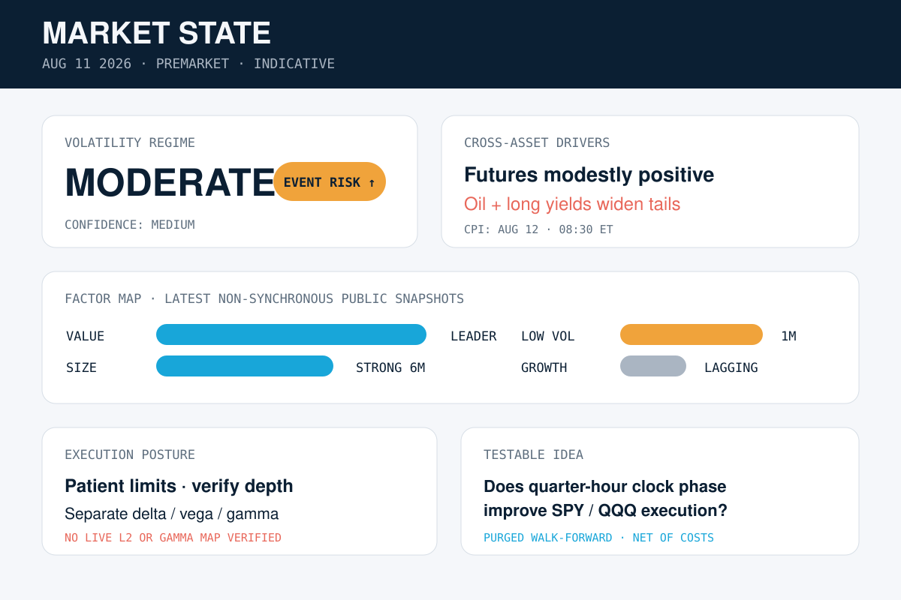

# Quant Market Brief — August 14, 2026

**Market State Lab**  
*Signals, regimes, and execution for systematic market decisions*

**Research cutoff:** 7:25 a.m. ET / 6:25 a.m. CT, Friday, August 14, 2026. Premarket prices are **indicative**, index and ETF closes are **prior-close**, and no live Level 2 or consolidated options feed was available.

## Executive signal

U.S. equity futures were nearly flat after a record S&P 500 close, while VIX held near 14.6. The base case is a **low-volatility, event-fragile** regime: calm index pricing contrasts with an 8:30 a.m. ET retail-sales release, higher oil, and material single-name/index-rebalance flows.

## 1. AI / ML — Anthropic is reportedly in talks to acquire Decart AI

*Image: Market State Lab original category graphic. Source credit: Market State Lab.*

**Facts.** Reuters reported on August 13 that Anthropic is in talks to buy AI infrastructure and model developer Decart AI. A separate Reuters Breakingviews analysis discussed a reported price near $6 billion; Decart had been valued around $4 billion in May.

**Inference.** Owning inference-efficiency technology could help Anthropic reduce serving costs and protect margins as frontier-model competition shifts from raw capability toward price/performance.

**Uncertainty.** The negotiations are private, a transaction is not final, and the reported valuation and strategic benefits are not confirmed by the companies.

**Why it matters.** ML teams should benchmark throughput, latency, memory use and cost per successful task—not model quality alone. For the AI stack, efficiency IP may become as strategically important as access to accelerators.

**Source:** [Reuters, August 13, 2026](https://www.reuters.com/technology/anthropic-talks-buy-decart-ai-source-says-2026-08-13/) · [Reuters Breakingviews, August 13, 2026](https://www.reuters.com/commentary/breakingviews/anthropics-ma-algorithm-optimizes-margins-2026-08-13/)

## 2. Algorithmic trading / quantitative finance — Reddit’s S&P 500 entry sets up a concentrated index-flow event

*Image: Market State Lab original category graphic. Source credit: Market State Lab.*

**Facts.** Reddit is scheduled to replace AvalonBay Communities in the S&P 500 before trading opens on August 18. Reuters reported Reddit up more than 12% in Friday premarket trading and cited a J.P. Morgan estimate that index trackers may need about 16.7 million shares, versus roughly 5.98 million in average daily volume.

**Inference.** The rebalance can create unusually high participation, temporary price pressure and closing-auction sensitivity in RDDT and related baskets. The estimated flow is not the same as guaranteed net demand.

**Uncertainty.** Fund implementation methods, active arbitrage, creations/redemptions and discretionary pre-positioning make the final realized flow and post-inclusion performance uncertain.

**Why it matters.** Event-driven models should separate announcement drift from effective-date auction demand, cap participation against real-time depth, and test exits after the forced-buying window rather than extrapolating the premarket jump.

**Source:** [Reuters, August 14, 2026](https://www.reuters.com/business/finance/reddit-surges-sp-500-inclusion-set-replace-avalonbay-2026-08-14/)

## 3. U.S. markets / options — Record S&P close meets flat futures and higher oil

*Image: Market State Lab original category graphic. Source credit: Market State Lab.*

**Facts.** The S&P 500 closed August 13 at a record 7,798.99, up 0.7%; the Nasdaq gained 0.8% to 26,803.03, the Dow added 0.1% to 53,839.99, and the Russell 2000 rose 0.2% to 3,052.85. Early August 14 Reuters indications put Dow E-minis down 0.12%, S&P 500 E-minis up 0.07%, and Nasdaq 100 E-minis up 0.18%. VIX was reported near 14.6 while Brent rose to about $88.50 amid renewed U.S.–Iran tension.

**Inference.** Index calm is masking cross-asset and single-name dispersion. A low VIX makes the regime look benign, but oil and the morning data release can still produce abrupt changes in depth and skew.

**Uncertainty.** Futures, VIX and oil observations are time-sensitive and were not synchronized to one tick. Live SPY/QQQ spreads, option surfaces and dealer-gamma positioning were not independently verified.

**Why it matters.** Avoid treating a near-flat futures print as proof of deep liquidity. For SPY/QQQ, require spread and depth recovery after the auction; for options, compare implied move with realized macro sensitivity and use executable quotes.

**Sources:** [AP index close, August 13, 2026](https://apnews.com/article/892c5409d8ed26bfd5965eb2a89d9005) · [Reuters premarket, August 14, 2026](https://www.reuters.com/business/wall-st-futures-muted-higher-oil-prices-temper-risk-appetite-after-sp-record-2026-08-14/) · [Reuters oil, August 14, 2026](https://www.reuters.com/business/energy/oil-steadies-after-us-threatens-blockade-iran-indefinitely-2026-08-14/)

## 4. U.S. economy / Federal Reserve — July producer inflation cools, but the annual rate remains elevated

*Image: Market State Lab original category graphic. Source credit: Market State Lab.*

**Facts.** The July Producer Price Index was unchanged month over month and rose 4.7% year over year, down from 5.5% in June. Core PPI excluding food and energy rose 0.2% for the month and 4.2% over twelve months. Goods prices fell 0.7% while services rose 0.2%.

**Inference.** Cooling pipeline inflation reduces immediate pressure for a September rate increase, but the annual core rate is still inconsistent with a clean return to the Fed’s 2% inflation objective.

**Uncertainty.** PPI is revised and does not map one-for-one into core PCE. Higher late-July and August fuel prices could reverse part of the goods-price relief.

**Why it matters.** Rates and QQQ-duration models should treat the print as one input, not a policy verdict. Today’s 8:30 a.m. ET retail-sales release can change the growth/inflation mix before the cash open.

**Sources:** [Reuters, August 13, 2026](https://www.reuters.com/business/us-producer-prices-unchanged-july-2026-08-13/) · [AP, August 14, 2026](https://apnews.com/article/f9bf278f4550a956b1f350722817371d) · [BLS release schedule](https://www.bls.gov/schedule/news_release/ppi.htm)

## 5. Major technology / business — Applied Materials raises its outlook, but shares fall on a demanding bar

*Image: Market State Lab original category graphic. Source credit: Market State Lab.*

**Facts.** Applied Materials reported fiscal third-quarter revenue of $9.12 billion, up 25% year over year, and adjusted earnings of $3.50 per share. It guided fiscal fourth-quarter revenue to about $10.25 billion and adjusted earnings to about $4.02 per share, both above cited analyst estimates. Reuters reported the shares down more than 5% after hours and about 5.4% in Friday premarket trading despite the forecast.

**Inference.** The reaction says expectations and positioning matter as much as absolute AI-capex growth. Advanced-packaging demand can remain strong while the stock de-rates if the market already discounts faster upside.

**Uncertainty.** Guidance is a range, customer spending can shift, and order visibility through 2030 does not guarantee revenue, margin or cash conversion.

**Why it matters.** Semiconductor factor models should include estimate dispersion, pre-earnings momentum and implied move—not only surprise magnitude. Track AMAT with LRCX, KLAC, MU and SMH for confirmation or divergence.

**Source:** [Reuters, August 13, 2026](https://www.reuters.com/business/applied-materials-forecasts-quarterly-revenue-above-estimates-2026-08-13/)

# Quant & Market Dashboard

## Overnight liquidity

- **Futures:** Early Reuters indications were Dow E-minis -0.12%, S&P 500 E-minis +0.07%, and Nasdaq 100 E-minis +0.18%. These are **indicative**, not live. ES/NQ top-of-book spreads, depth, queue position and overnight volume were not available from a reliable public feed.
- **Cash/ETF proxy:** Prior-session U.S. equity volume was reported below the 2026 daily average in one consolidated snapshot. Premarket SPY/QQQ displayed liquidity is not a substitute for regular-session depth.
- **Treasury/funding proxy:** The 10-year Treasury yield was reported near 4.67% in an early market snapshot. Same-morning repo specialness, SOFR and Treasury depth were not independently verified; there is no verified sign of funding stress, but that conclusion is low confidence.
- **Cross-asset pressure:** Brent near $88.50 and WTI near $82.81 were time-sensitive indications. Oil is the clearest overnight challenge to the otherwise calm equity-volatility signal.

## Volatility regime

**Classification: LOW, event-fragile. Confidence: medium-high.** Evidence: VIX near 14.6, a record S&P close and small index-futures moves argue against a stressed regime. Confidence is not high because retail sales arrive before the open, oil is rising, and live VIX term structure, skew and dealer-gamma maps were not verified.

## Factor performance

Synchronized, live factor returns were unavailable. The short-horizon proxy is the week through the August 13 close; the medium horizon is year to date. Russell 2000 led with **+0.6% for the week and +23.0% YTD**, versus Nasdaq **+0.4% and +15.3%** and S&P 500 **+0.5% and +13.9%**. That cautiously favors **size** and broader risk participation over pure mega-cap growth.

| Factor | Practical proxy | Short horizon | Medium horizon | Read |
|---|---|---|---|---|
| Momentum | MTUM / leadership persistence | No synchronized weekly return verified | Official Jun. 30 snapshot: +37.41% YTD | Strong medium-term trend; reversal/crowding risk remains material. |
| Value | IWD | No synchronized weekly return verified | Official Jun. 30 snapshot: +16.12% YTD | Positive breadth; below momentum and current size proxy. |
| Quality | QUAL | No synchronized weekly return verified | Official Jun. 30 snapshot: +11.10% YTD | Positive but not dominant; use as ballast rather than leadership signal. |
| Size | Russell 2000 / IWM | +0.6% week | +23.0% YTD | Current leader among the verified broad-index proxies. |
| Growth | Nasdaq / IWF | +0.4% week | Nasdaq +15.3% YTD | Positive, but lagging small caps over the medium proxy. |
| Low volatility | USMV | No synchronized weekly return verified | Official late-July snapshot: +5.14% YTD | Lagging risk-on factors; useful if oil/rates destabilize breadth. |

Factor ETF sources: [MTUM](https://www.ishares.com/us/products/251614/MTUM), [IWD](https://www.ishares.com/us/products/239708/ishares-russell-1000-value-etf), [QUAL](https://www.ishares.com/us/products/256101/QUAL), [USMV](https://www.ishares.com/us/products/239695/USMV). Snapshot dates differ, so do not use this table for precise attribution.

## Execution risk: SPY, QQQ and options

- **Event timing:** July retail sales are scheduled for 8:30 a.m. ET, one hour before the cash open. Expect a two-stage price discovery process: macro repricing, then auction clearing.
- **Opening auction:** Use limit prices and participation caps; compare the auction print with ES/NQ fair value and wait for spread/depth normalization before treating the first move as executable trend.
- **Slippage:** Quoted spread understates cost when depth is thin. Track implementation shortfall against decision, arrival and auction benchmarks.
- **Options:** 0DTE gamma and charm can destabilize hedge ratios around large strikes. Use fresh underlying/option timestamps, executable bid/ask marks and quote-age filters; do not assume midpoint fills.
- **Liquidity traps:** Premarket ETF prints, far-OTM weeklies, one-sided size, sparse multi-leg books and market orders during oil/rate shocks.

## Microstructure actions and watchlist

- Require confirmation across ES/NQ, the two-year yield and breadth before following the first retail-sales impulse.
- If SPY/QQQ rise while IWM and HYG lag, lower confidence in broad momentum; if IWM confirms, the size signal is more credible.
- Treat RDDT/AVB effective-date flows as event-specific; keep them out of generic alpha labels unless the index event is explicitly modeled.
- **Watchlist:** SPY, QQQ, IWM, VIXY, TLT, HYG, USO, MTUM, IWD, QUAL, USMV, RDDT, AVB, AMAT, LRCX, KLAC, MU and SMH.

## DRL Improvements for the MATLAB System

1. **Risk projection layer:** map policy actions onto admissible leverage, turnover, concentration, drawdown-state and liquidity-participation constraints before orders reach the simulator.
2. **Execution-aware reward:** subtract spread, nonlinear impact, latency, adverse selection and missed-fill penalties; add a tail-risk term and a no-trade action.
3. **Purged walk-forward evaluation:** refit on rolling windows, purge overlapping labels, embargo adjacent samples and report performance distributions by volatility, liquidity and event regime.
4. **Regime robustness:** randomize oil, rates, depth and volatility states during training; gate exposure when ensemble disagreement or state novelty is high.

## Model hygiene

- Fit scalers, feature selectors and regime labels inside each fold to prevent leakage and look-ahead bias.
- Use point-in-time universes to control survivorship bias; process splits, dividends, mergers, index changes and other corporate actions consistently.
- Reject stale or crossed option quotes; align option and underlying timestamps and retain bid/ask rather than midpoint alone.
- Maintain a specification registry, control multiple testing and preserve a locked holdout. Recalibrate probabilities and monitor feature, residual, execution-cost and policy drift.

## MATLAB optimization patterns

1. Store prices, macro events and option observations in `timetable` objects; call `synchronize` and `retime` once upstream rather than inside training loops.
2. Vectorize rolling features and reward components, preallocate replay/episode buffers, and profile with `profile` and `timeit` before parallelizing.
3. Run Bayesian optimization and walk-forward folds in parallel with reproducible `RandStream` substreams.
4. Use GPUs for large dense neural-network batches; keep branch-heavy order-book and timetable logic on CPU unless transfer-adjusted profiling supports a move.

## High-value quant research question

**Does the opening-auction liquidity state after retail-sales releases improve first-30-minute SPY/QQQ execution timing beyond the data surprise, overnight ES/NQ return, prior-close VIX and option-implied move—net of implementation shortfall?**

It is worth testing because it separates macro direction from the tradeability of that direction. A successful result would improve entry timing without requiring a stronger return forecast.

---

**Disclosure:** Research and education only; not individualized financial advice. Data may be delayed, indicative or revised. Market State Lab distinguishes reported facts from inference and states material uncertainty, but no source set is complete.
