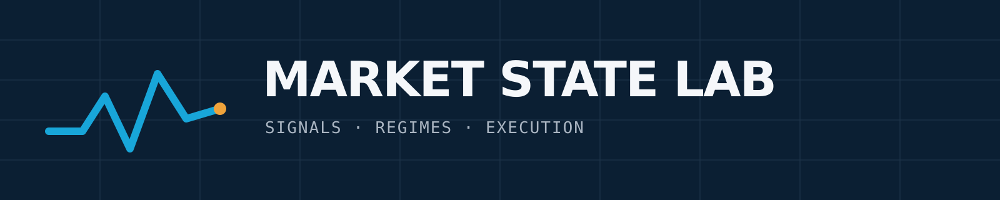

# Quant Market Brief — Inaugural Edition

**Tuesday, August 11, 2026 · Research snapshot compiled 6:30–7:15 a.m. CT**  
**Five developments. One market state. One testable idea.**

## 60-second decision panel

- **State:** Moderate volatility with high scheduled-event risk; confidence medium because live VIX term structure and Level 2 futures depth were not independently verified.
- **Primary driver:** Long-end Treasury yields and oil are competing with modestly positive equity futures ahead of July CPI.
- **Execution posture:** Favor patient limit execution, reduce opening-auction urgency, and avoid reading pre-CPI option premium as pure directional conviction.
- **Factor read:** Latest comparable public snapshots favor value over growth at medium horizons; short-horizon defensive leadership is visible but data are not synchronous with today's premarket.
- **Research focus:** Test whether quarter-hour clock phase adds net information to a liquidity-conditioned SPY/QQQ execution policy.

---

## 1. AI infrastructure moves from training scarcity to inference-scale contracting

*Image: Market State Lab original. Source basis: Reuters reporting on IBM, Together AI, and NVIDIA, August 11, 2026.*

**Confirmed.** IBM and Together AI agreed to a multi-year deal valued at $240 million to build an NVIDIA-powered inference cluster on IBM Cloud. Reuters reports that the system will use HGX B300 hardware and Spectrum-X networking to serve open-model workloads. The report was published August 11, 2026.

**Why it matters.** Inference is becoming a distinct capital cycle rather than a residual use of training infrastructure. For technology models, track utilization, networking intensity, and contracted cloud demand—not only GPU shipments. Relevant symbols: **IBM, NVDA**.

**Inference.** If similar contracts proliferate, enterprise AI spending may shift toward usage-linked capacity and managed infrastructure, benefiting networking and cloud orchestration alongside accelerators.

**Uncertainty.** Detailed deployment timing, capacity, margins, and contract performance obligations were not disclosed in the source used here.

[Direct source: Reuters — August 11, 2026](https://www.reuters.com/business/ibm-together-ai-ink-240-million-deal-nvidia-powered-ai-inference-cluster-2026-08-11/)

---

## 2. Crypto futures reveal a quarter-hour algorithmic clock

*Image: Market State Lab original. Source basis: Kim and Hansen, arXiv:2607.09426.*

**Confirmed.** A July 2026 preprint by Chan Kim and Peter Reinhard Hansen examines six Binance perpetual-futures contracts and documents recurring bursts in volatility and volume at one-, five-, and fifteen-minute marks. Their clock-phase analysis finds that quarter-hour opening order imbalance predicts returns over four-to-twelve-hour horizons out of sample, while finer clock marks are less informative.

**Why it matters.** Execution models that treat intraday time as a smooth spline can miss discrete algorithmic synchronization. A practical test is to add clock-phase features, then measure whether any predictive lift survives fees, funding, spread, queue delay, and walk-forward embargoes.

**Inference.** The effect may reflect synchronized model schedules, funding/data refreshes, or benchmarked execution rather than a universal behavioral anomaly.

**Uncertainty.** This is a preprint, covers crypto perpetuals on one venue family, and may not transfer to U.S. ETFs or persist after publication.

[Direct source: arXiv — revised July 2026](https://arxiv.org/abs/2607.09426)

---

## 3. Equity futures lean higher while oil and long yields keep the distribution fat-tailed

*Image: Market State Lab original. Source basis: Reuters and Barron's market reporting, August 11, 2026.*

**Confirmed.** A Barron's premarket snapshot reported S&P 500 futures up 0.14%, Dow futures up 0.05%, VIX futures down 0.24%, and the 10-year Treasury yield at 4.717%. Reuters separately described Brent near $90 and the 30-year Treasury yield near 5.28% as markets waited for the July CPI release. These figures are **indicative and time-sensitive**, retrieved during the 6:30–7:15 a.m. CT research window.

**Why it matters.** A calm index-futures print can understate cross-asset stress. SPY and QQQ traders should treat oil and the long bond as real-time risk factors; options traders should separate pre-event implied volatility from post-release directional edge.

**Inference.** The setup favors intraday volatility around rate-sensitive growth and energy exposures even if headline indexes open near flat.

**Uncertainty.** Exact oil levels differed across same-day reports as negotiations and prices evolved. No reliable live SPY/QQQ option surface or futures order-book depth was available for this edition.

[Direct source: Reuters global markets — August 11, 2026](https://www.reuters.com/world/china/global-markets-global-markets-2026-08-11/) · [Barron's premarket snapshot](https://www.barrons.com/articles/s-p-500-futures-climb-in-premarket-trading-life360-on-holding-lag-9f56f508)

---

## 4. July CPI is the next policy hinge; the best public nowcast still carries oil-model risk

*Image: Market State Lab original. Source basis: U.S. Bureau of Labor Statistics and Federal Reserve Bank of Cleveland.*

**Confirmed.** The Bureau of Labor Statistics will release July CPI at **8:30 a.m. ET on Wednesday, August 12, 2026**. The latest Cleveland Fed snapshot available to this research, updated July 27, estimated July CPI at 0.04% month over month and 3.37% year over year; core CPI was estimated at 0.21% month over month and 2.52% year over year.

**Why it matters.** The gap between soft modeled monthly headline inflation and elevated oil-driven market concern creates two-way duration risk. Do not interpret the nowcast as a tradable consensus; use it as one input to scenario ranges for rates, QQQ duration, and option volatility crush.

**Inference.** A material upside surprise in core inflation would likely matter more for persistent policy expectations than a headline miss driven by volatile energy components.

**Uncertainty.** The nowcast is a model estimate and the accessible page snapshot was not current to August 11. The Cleveland Fed notes that daily oil and weekly gasoline prices feed the model, making headline estimates sensitive to energy moves.

[BLS release schedule](https://www.bls.gov/schedule/2026/08_sched_list.htm) · [Cleveland Fed inflation nowcasting](https://www.clevelandfed.org/indicators-and-data/inflation-nowcasting)

---

## 5. Intel turns a powerful share rally into a $20 billion foundry-capital raise

*Image: Market State Lab original. Source basis: Reuters, MarketWatch, and Barron's reporting, August 10–11, 2026.*

**Confirmed.** Intel upsized a planned equity offering from $15 billion to $20 billion, with reports describing 210.5 million shares priced at $95. The company said proceeds could support general corporate purposes, including capital expenditure and working capital, as it pursues foundry and data-center growth.

**Why it matters.** This is a clean test of whether public-market enthusiasm for AI infrastructure can finance the slow, capital-intensive semiconductor buildout without overwhelming dilution. Track foundry customer wins, capital intensity, free-cash-flow conversion, and share-count growth—not revenue alone. Relevant symbol: **INTC**.

**Inference.** A successful placement reduces near-term financing uncertainty but raises the burden of proof on returns from 18A/14A manufacturing and external foundry demand.

**Uncertainty.** Offering completion, final net proceeds, use of proceeds, and future foundry returns remain subject to execution and market conditions.

[Direct source: MarketWatch — August 11, 2026](https://www.marketwatch.com/story/intel-now-says-it-is-selling-20-billion-of-stock-166e2dfe) · [Reuters analysis — August 10, 2026](https://www.reuters.com/commentary/breakingviews/intel-follows-easy-fixes-with-hard-ones-2026-08-10/)

---

# Quant & Market Dashboard

## Overnight liquidity

- **Equity futures:** Indicative S&P 500 futures were modestly positive in a same-morning report. Live spread, depth, queue, and overnight volume were not reliably verified; assume thinner-than-regular-hours depth and validate the inside market before sizing.
- **ETFs:** SPY/QQQ were premarket instruments at the research timestamp. Regular-session ETF spread and depth statistics do not transfer mechanically to premarket.
- **Treasuries/funding:** The 10-year yield was reported near 4.72% and the 30-year near 5.28%. No reliable same-morning SOFR, repo-specialness, or Treasury order-book feed was available; long-end yield pressure is the cautious funding/liquidity proxy.
- **Microstructure implication:** If the cash open gaps against the overnight futures direction while long yields rise, avoid crossing wide opening spreads. Let the auction clear, then compare realized spread, depth recovery, and first-interval imbalance.

## Volatility regime

**Moderate, with high event risk — confidence: medium.** Evidence: modestly positive equity futures and slightly lower VIX futures argue against a stressed state, while oil near $90, historically high long yields, geopolitical uncertainty, and next-day CPI keep gap and skew risk elevated. A live VIX level and term structure were not independently verified.

## Factor performance — latest verified public snapshots, not today's close

| Factor | Proxy | Short horizon | Medium horizon | Read |
|---|---|---:|---:|---|
| Momentum | MTUM | 1M -7.19% | 6M +17.90% | Recent reversal after a strong run |
| Value | VLUE/VTV | 1M -2.36% / +1.20% | 6M +36.03% / +13.03% | Medium-horizon leader |
| Quality | QUAL | 1M +1.68% | 6M +7.06% | Stable, near broad-market pace |
| Size | IWM | 1M -2.31% | 6M +11.42% | Strong medium horizon; recent giveback |
| Growth | VUG | 1M +0.87% | 6M +3.82% | Lagging value materially |
| Low volatility | USMV | 1M +2.68% | 6M +4.14% | Short-horizon defense |

These public ETF snapshots came from PortfoliosLab pages last updated roughly July 26–29, 2026; MTUM/VLUE snapshot timing was not exposed consistently. They are non-synchronous proxies and must be refreshed before trading. Sources: [QUAL/SPY](https://portfolioslab.com/tools/stock-comparison/QUAL/SPY), [IWM/SPY](https://portfolioslab.com/tools/stock-comparison/IWM/SPY), [VUG/VTV](https://portfolioslab.com/tools/stock-comparison/VUG/VTV), [USMV/SPY](https://portfolioslab.com/tools/stock-comparison/USMV/SPY), [MTUM/VLUE](https://portfolioslab.com/tools/stock-comparison/MTUM/VLUE).

## Execution risk: SPY, QQQ, and options

- Treat the opening auction and first 5–15 minutes as a separate regime; use participation caps and limit prices tied to observed depth recovery.
- For options, compare limit price to a fresh underlying quote and discard crossed, locked, or stale markets. Do not use midpoint fills mechanically in backtests.
- CPI is next morning: near-dated implied volatility can collapse even when direction is correct. Separate delta, vega, and gamma P&L in scenario tests.
- 0DTE gamma can amplify index moves around large strikes, but no verified dealer-gamma map is available here; avoid asserting a pin or squeeze level.
- Liquidity traps: far OTM contracts, multi-leg packages with a weak leg, premarket ETF prints, and market orders during yield or oil shocks.

## Watchlist

**Index/vol:** SPY, QQQ, IWM, VIXY  
**Rates/energy:** TLT, SHY, USO  
**Factors:** MTUM, VLUE, QUAL, USMV, VUG, VTV  
**Story symbols:** IBM, NVDA, INTC

## DRL Improvements for the MATLAB System

1. **Constrained risk layer:** Place an action-projection layer after the policy so leverage, turnover, concentration, drawdown state, and liquidity participation remain inside generic capital-preservation limits.
2. **Execution-aware reward:** Decompose reward into mark-to-market return, spread paid, estimated impact, missed-fill penalty, inventory risk, and tail-risk penalty. Train on randomized cost and latency regimes.
3. **Purged walk-forward evaluation:** Refit on expanding or rolling windows, purge overlapping labels, embargo adjacent samples, and report distributions across regimes instead of one pooled score.
4. **Regime robustness:** Randomize oil, rate, volatility, and depth states during training; include a no-trade action and evaluate policy stability when the regime classifier is wrong.

## Model hygiene

- Freeze point-in-time universes and fundamentals to prevent survivorship and look-ahead bias.
- Adjust splits, dividends, symbol changes, and corporate actions before feature construction.
- Reject stale option quotes and model realistic multi-leg execution; never assume every midpoint fills.
- Keep train/validation/test transformations fit only on prior data.
- Control multiple testing with a research registry, deflated performance statistics, and holdout reuse limits.
- Calibrate probabilities by regime; monitor feature, prediction, cost, and residual drift.

## MATLAB optimization patterns

1. Store price, macro, and event data in synchronized `timetable` objects; use `retime` and `synchronize` once upstream instead of repeated joins in the training loop.
2. Vectorize feature and reward calculations, profile with `profile`/`timeit`, and parallelize independent walk-forward folds or Bayesian-optimization trials with reproducible `RandStream` substreams.
3. Use GPU arrays only for large dense tensor workloads; keep order-book parsing and irregular timetable logic on CPU unless profiling demonstrates a transfer-adjusted benefit.
4. Separate market environment, cost model, risk projector, policy, and evaluator into modular functions so each can be unit-tested and swapped independently.

## High-value quant question

**Does a quarter-hour clock-phase feature improve net out-of-sample SPY/QQQ intraday execution after conditioning on spread/depth state and excluding scheduled macro windows?**

Why test it: the crypto result is plausible but market-specific. A falsifiable cross-market test can determine whether clock synchronization is transferable signal, a venue artifact, or merely a proxy for scheduled liquidity changes.

---

*Research and education only; not individualized financial advice. Data may be delayed or indicative. Verify current prices, liquidity, and option markets before acting.*
