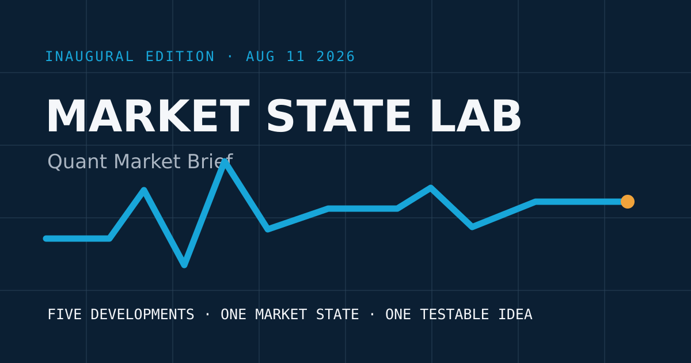

# Market State Lab

**Signals, regimes, and execution for systematic market decisions.**

Market State Lab is a free premarket publication for quantitative traders, MATLAB users, and market practitioners. The daily **Quant Market Brief** compresses exactly five important developments into a market-state view with explicit data quality, execution risk, model hygiene, and one testable research question.

The future paid product, **Quant Lab**, will be a weekly reproducible research note with code, walk-forward tests, cost assumptions, and a public change log. It is intentionally not enabled at launch.

## Inaugural publication

- [Quant Market Brief — August 11, 2026](INAUGURAL_ISSUE.md)
- [Source snapshot](SOURCE_SNAPSHOT.csv)
- [Methodology and source standards](METHODOLOGY.md)
- [Editorial and corrections policy](EDITORIAL_POLICY.md)
- [Risk disclosure](DISCLOSURES.md)
- [Channel launch playbook](CHANNEL_PLAYBOOK.md)
- [MATLAB market-state function](marketStateScore.m)
- [Complete structured launch package](market-state-lab-launch-package.zip)

## Publication architecture

| Product | Cadence | Access | Purpose |
|---|---:|---|---|
| Quant Market Brief | Weekday premarket | Free | Five developments, regime map, execution risk, and one testable idea |
| Quant Lab | Weekly, later phase | Paid later | Reproducible MATLAB research, robustness tests, and implementation notes |
| GitHub companion | Per issue | Free | Sources, methods, code, revisions, and chart data |
| LinkedIn edition | Per issue | Free | Condensed decision panel and distribution |

Editorial content is © Market State Lab. Code in `marketStateScore.m` is released under the MIT License. Third-party facts and data remain subject to their providers’ terms.

This is research and education, not individualized financial advice. Markets involve risk, and models can fail.
